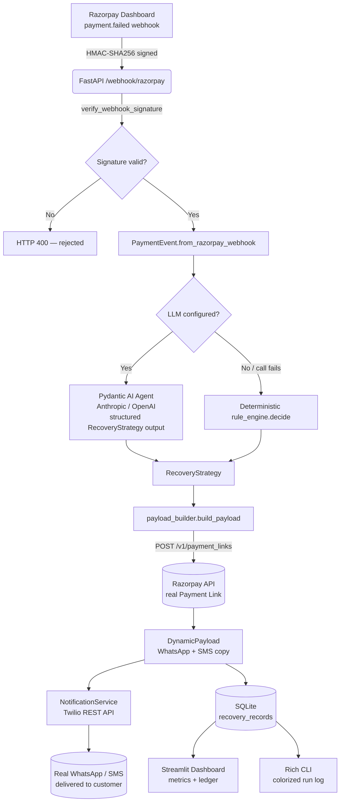

# Architecture — Razorpay ContextPulse

## Pipeline

## Why each piece is real, not simulated

| Stage | Library / API | What's real |
|---|---|---|
| Webhook ingress | FastAPI + `razorpay` SDK | HMAC signature verification via Razorpay's own `utility.verify_webhook_signature` |
| Decision / routing | `pydantic-ai` + Anthropic/OpenAI | A live model call, constrained to a validated `RecoveryStrategy` schema |
| Fallback routing | `src/rule_engine.py` | Deterministic, explainable, tagged `decided_by="deterministic_fallback"` — never silently swapped for the LLM path |
| Recovery link | `razorpay` SDK `payment_link.create()` | Real POST to `/v1/payment_links`, real `short_url` returned by Razorpay |
| Delivery | `twilio` SDK | Real `messages.create()` call, real message SID + delivery status |
| Persistence | `sqlite3` | On-disk DB (`contextpulse.db`), survives restarts, queryable directly |
| Dashboard / CLI | Streamlit / Rich | Thin clients over the FastAPI backend's HTTP API — no local mock state |

## The one necessarily-synthetic piece

A real bank auth-timeout, limit-cap decline, or OTP failure can only be produced by
an actual card network / issuing bank during a live transaction — no sandbox lets you
force one on demand. `POST /simulate/payment-failed` builds a webhook body in the
exact shape Razorpay sends for `payment.failed`, signs it with your real webhook
secret, and pushes it through the same signature-checked endpoint a genuine webhook
would hit. Everything from that point on (agent call, Razorpay Payment Link, Twilio
send, SQLite write) is a real external API call with your credentials.

## Recovery Rate & Impact Metrics

`GET /metrics` computes:
- **Failed Revenue Analyzed** — `SUM(amount)` across all processed events (real transaction amounts).
- **Auto-Recoveries** — count of records marked `recovered=1` (via `POST /events/{id}/mark-recovered`,
  intended to be called from a second webhook subscription to `payment_link.paid`).
- **Estimated Conversion Lift %** — `(agent_recovery_rate - baseline_dunning_recovery_rate) / baseline_dunning_recovery_rate * 100`,
  where the baseline (default 8%) is a configurable assumption representing passive email dunning —
  documented in `.env` as `BASELINE_DUNNING_RECOVERY_RATE` so it's never presented as a hidden constant.

## Closing the loop (production next step)

To fully automate "recovered" status without manual marking, subscribe to Razorpay's
`payment_link.paid` webhook in addition to `payment.failed`, and add a second handler
in `webhook_server.py` that calls `mark_recovered(event_id)` when a link created by
this system is paid — matched via the `contextpulse_strategy_id` note stored on the
Payment Link.
